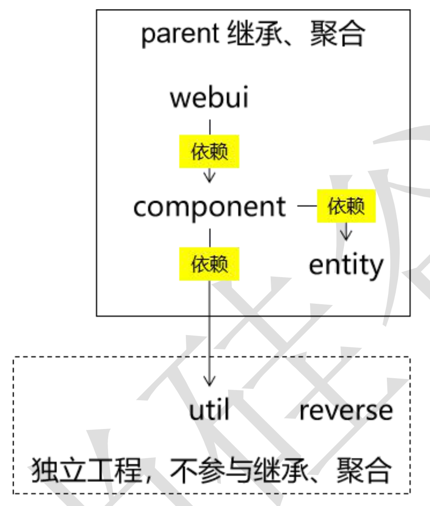
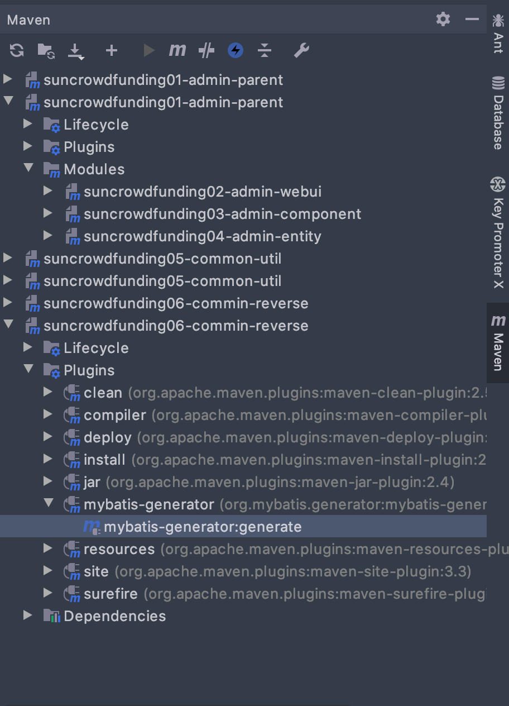

# atguigu_project_crowdFunding


## 环境搭建 v0.1

### 1. 总体目标


### 2. 创建工程 v0.0.2

#### 2.1 项目架构图



#### 2.2 工程创建计划

sunrowdfunding01-admin-parent 

​	groupId：com.sun.crowd 

​	artifactId：sunrowdfunding01-admin-parent 

​	packaging：pom 

sunrowdfunding02-admin-webui 

​	groupId：com.sun.crowd 

​	artifactId：sunrowdfunding02-admin-webui 

​	packaging：war 

suncrowdfunding03-admin-component 

​	groupId：com.sun.crowd 

​	artifactId：suncrowdfunding03-admin-component 

​	packaging：jar 

suncrowdfunding04-admin-entity 

​	groupId：com.sunu.crowd

​	artifactId：suncrowdfunding04-admin-entity 

​	packaging：jar 

suncrowdfunding05-common-util 

​	groupId：com.sun.crowd 

​	artifactId：suncrowdfunding05-common-util 

​	packaging：jar 

suncrowdfunding06-common-reverse 

​	groupId：com.sun.crowd 

​	artifactId：suncrowdfunding06-common-reverse 

​	packaging：jar 

#### 2.4 创建maven项目，搭建依赖关系

项目结构图


### 3 创建数据库和数据库表

#### 3.1 数据库创建

 ```sql
CREATE DATABASE `project_crowd` CHARACTER SET utf8;
 ```

#### 3.2 **创建管理员数据库表**

```sql
use project_crowd; 
drop table if exists t_admin; 
create table t_admin ( 
  id int not null auto_increment, # 主键 
  login_acct varchar(255) not null, # 登录账号 
  user_pswd char(32) not null, # 登录密码 
  user_name varchar(255) not null, # 昵称 
  email varchar(255) not null, # 邮件地址 
  create_time char(19), # 创建时间 
  primary key (id) );
```

### 4 **基于** **Maven** **的** **MyBatis** **逆向工程**

#### 4.1 配置reverse 模块中的pom.xml

添加mybatis.generator 插件

```xml
<!-- 控制 Maven 在构建过程中相关配置 -->
    <build>
        <!-- 构建过程中用到的插件 -->
        <plugins>
            <!-- 具体插件，逆向工程的操作是以构建过程中插件形式出现的 -->
            <plugin>
                <groupId>org.mybatis.generator</groupId>
                <artifactId>mybatis-generator-maven-plugin</artifactId>
                <version>1.3.0</version>
                <!-- 插件的依赖 -->
                <dependencies>
                    <!-- 逆向工程的核心依赖 -->
                    <dependency>
                        <groupId>org.mybatis.generator</groupId>
                        <artifactId>mybatis-generator-core</artifactId>
                        <version>1.3.2</version>
                    </dependency>
                    <!-- 数据库连接池 -->
                    <dependency>
                        <groupId>com.mchange</groupId>
                        <artifactId>c3p0</artifactId>
                        <version>0.9.2</version>
                    </dependency>
                    <!-- MySQL 驱动 -->
                    <dependency>
                        <groupId>mysql</groupId>
                        <artifactId>mysql-connector-java</artifactId>
                        <version>8.0.19</version>
                    </dependency>
                </dependencies>
            </plugin>
        </plugins>
    </build>
```


#### 4.2 mybatis-generator配置信息

```xml
<?xml version="1.0" encoding="utf-8"?>

<!DOCTYPE generatorConfiguration
        PUBLIC "-//mybatis.org//DTD MyBatis Generator Configuration 1.0//EN"
        "http://mybatis.org/dtd/mybatis-generator-config_1_0.dtd">
<generatorConfiguration>
    <!-- mybatis-generator:generate -->
    <context id="atguiguTables" targetRuntime="MyBatis3">
        <commentGenerator>
            <!-- 是否去除自动生成的注释 true:是;false:否 -->
            <property name="suppressAllComments" value="true"/>
        </commentGenerator>
        <!--数据库连接的信息：驱动类、连接地址、用户名、密码 -->
        <jdbcConnection
                driverClass="com.mysql.cj.jdbc.Driver"
                connectionURL="jdbc:mysql://192.168.31.144:3306/project_crowd"
                userId="root"
                password="Sun,123456"/>
        <!-- 默认 false，把 JDBC DECIMAL 和 NUMERIC 类型解析为 Integer，为 true 时把 JDBC DECIMAL和 NUMERIC 类型解析为 java.math.BigDecimal -->
        <javaTypeResolver>
            <property name="forceBigDecimals" value="false"/>
        </javaTypeResolver>
        <!-- targetProject:生成 Entity 类的路径 -->
        <javaModelGenerator targetProject="./src/main/java"
                            targetPackage="com.sun.crowd.entity">
            <!-- enableSubPackages:是否让 schema 作为包的后缀 -->
            <property name="enableSubPackages" value="false"/>
            <!-- 从数据库返回的值被清理前后的空格 -->
            <property name="trimStrings" value="true"/>
        </javaModelGenerator>
        <!-- targetProject:XxxMapper.xml 映射文件生成的路径 -->
        <sqlMapGenerator targetProject="./src/main/java"
                         targetPackage="com.sun.crowd.mapper">
            <!-- enableSubPackages:是否让 schema 作为包的后缀 -->
            <property name="enableSubPackages" value="false"/>
        </sqlMapGenerator>
        <!-- targetPackage：Mapper 接口生成的位置 -->
        <javaClientGenerator type="XMLMAPPER"
                             targetProject="./src/main/java"
                             targetPackage="com.sun.crowd.mapper">
            <!-- enableSubPackages:是否让 schema 作为包的后缀 -->
            <property name="enableSubPackages" value="false"/>
        </javaClientGenerator>
        <!-- 数据库表名字和我们的 entity 类对应的映射指定 -->
        <table tableName="t_admin" domainObjectName="Admin"/>
    </context>
</generatorConfiguration>
```


配置完成后使用插件指令完成逆向工程




#### 4.4 **逆向工程生成的资源各归各位**

WebUI 工程将来在 Tomcat 上运行时，现在 resources 目录下的资源会直接放在 

WEB-INF/classes 目录（也就是类路径）下，所以放在 resources 目录下运行的时候更容 

易找到。

