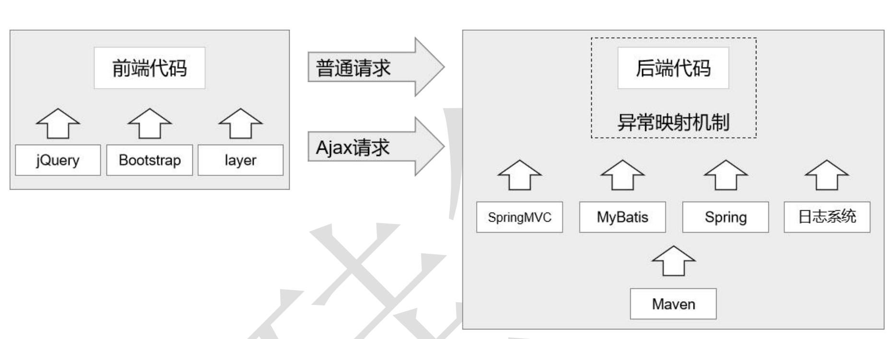

# atguigu_project_crowdFunding

## 环境搭建 v0.1

### 1. 总体目标

### 2. 创建工程 v0.0.2

#### 2.1 项目架构图

#### 2.2 工程创建计划

sunrowdfunding01-admin-parent 

​	groupId：com.sun.crowd 

​	artifactId：sunrowdfunding01-admin-parent 

​	packaging：pom 

sunrowdfunding02-admin-webui 

​	groupId：com.sun.crowd 

​	artifactId：sunrowdfunding02-admin-webui 

​	packaging：war 

suncrowdfunding03-admin-component 

​	groupId：com.sun.crowd 

​	artifactId：suncrowdfunding03-admin-component 

​	packaging：jar 

suncrowdfunding04-admin-entity 

​	groupId：com.sunu.crowd

​	artifactId：suncrowdfunding04-admin-entity 

​	packaging：jar 

suncrowdfunding05-common-util 

​	groupId：com.sun.crowd 

​	artifactId：suncrowdfunding05-common-util 

​	packaging：jar 

suncrowdfunding06-common-reverse 

​	groupId：com.sun.crowd 

​	artifactId：suncrowdfunding06-common-reverse 

​	packaging：jar 

#### 2.4 创建maven项目，搭建依赖关系

项目结构图

