# 环境搭建 v0.1

## 1. 总体目标

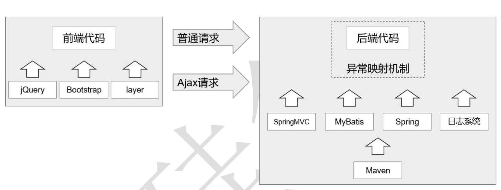

## 2. 创建工程 v0.0.2

### 2.1 项目架构图

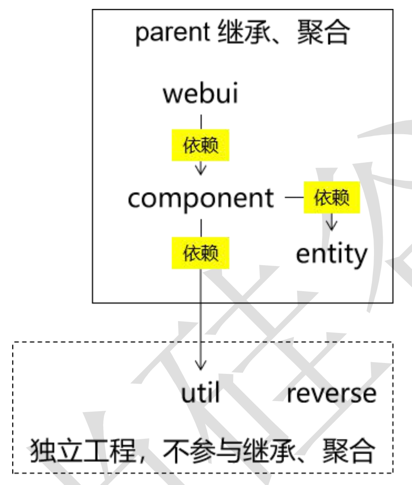

### 2.2 工程创建计划

sunrowdfunding01-admin-parent 

​	groupId：com.sun.crowd 

​	artifactId：sunrowdfunding01-admin-parent 

​	packaging：pom 

sunrowdfunding02-admin-webui 

​	groupId：com.sun.crowd 

​	artifactId：sunrowdfunding02-admin-webui 

​	packaging：war 

suncrowdfunding03-admin-component 

​	groupId：com.sun.crowd 

​	artifactId：suncrowdfunding03-admin-component 

​	packaging：jar 

suncrowdfunding04-admin-entity 

​	groupId：com.sunu.crowd

​	artifactId：suncrowdfunding04-admin-entity 

​	packaging：jar 

suncrowdfunding05-common-util 

​	groupId：com.sun.crowd 

​	artifactId：suncrowdfunding05-common-util 

​	packaging：jar 

suncrowdfunding06-common-reverse 

​	groupId：com.sun.crowd 

​	artifactId：suncrowdfunding06-common-reverse 

​	packaging：jar 

### 2.4 创建maven项目，搭建依赖关系

项目结构图

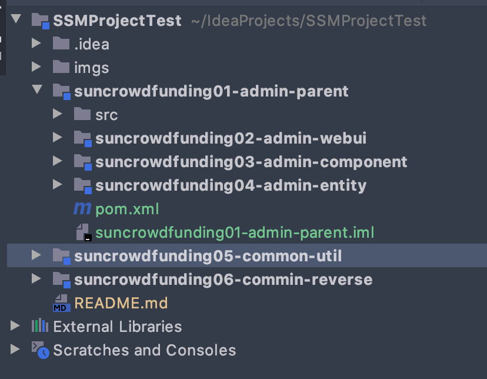

## 3. 创建数据库和数据库表

### 3.1 数据库创建

 ```sql
CREATE DATABASE `project_crowd` CHARACTER SET utf8;
 ```

### 3.2 创建管理员数据库表

```sql
use project_crowd; 
drop table if exists t_admin; 
create table t_admin ( 
  id int not null auto_increment, # 主键 
  log_acct varchar(255) not null, # 登录账号 
  user_pswd char(32) not null, # 登录密码 
  user_name varchar(255) not null, # 昵称 
  email varchar(255) not null, # 邮件地址 
  create_time char(19), # 创建时间 
  primary key (id) );
```

## 4. 基于 Maven **的** **MyBatis** **逆向工程** v0.0.4

### 4.1 配置reverse 模块中的pom.xml

添加mybatis.generator 插件

```xml
<!-- 控制 Maven 在构建过程中相关配置 -->
    <build>
        <!-- 构建过程中用到的插件 -->
        <plugins>
            <!-- 具体插件，逆向工程的操作是以构建过程中插件形式出现的 -->
            <plugin>
                <groupId>org.mybatis.generator</groupId>
                <artifactId>mybatis-generator-maven-plugin</artifactId>
                <version>1.3.0</version>
                <!-- 插件的依赖 -->
                <dependencies>
                    <!-- 逆向工程的核心依赖 -->
                    <dependency>
                        <groupId>org.mybatis.generator</groupId>
                        <artifactId>mybatis-generator-core</artifactId>
                        <version>1.3.2</version>
                    </dependency>
                    <!-- 数据库连接池 -->
                    <dependency>
                        <groupId>com.mchange</groupId>
                        <artifactId>c3p0</artifactId>
                        <version>0.9.2</version>
                    </dependency>
                    <!-- MySQL 驱动 -->
                    <dependency>
                        <groupId>mysql</groupId>
                        <artifactId>mysql-connector-java</artifactId>
                        <version>8.0.19</version>
                    </dependency>
                </dependencies>
            </plugin>
        </plugins>
    </build>
```


### 4.2 mybatis-generator配置信息

```xml
<?xml version="1.0" encoding="utf-8"?>

<!DOCTYPE generatorConfiguration
        PUBLIC "-//mybatis.org//DTD MyBatis Generator Configuration 1.0//EN"
        "http://mybatis.org/dtd/mybatis-generator-config_1_0.dtd">
<generatorConfiguration>
    <!-- mybatis-generator:generate -->
    <context id="atguiguTables" targetRuntime="MyBatis3">
        <commentGenerator>
            <!-- 是否去除自动生成的注释 true:是;false:否 -->
            <property name="suppressAllComments" value="true"/>
        </commentGenerator>
        <!--数据库连接的信息：驱动类、连接地址、用户名、密码 -->
        <jdbcConnection
                driverClass="com.mysql.cj.jdbc.Driver"
                connectionURL="jdbc:mysql://192.168.31.144:3306/project_crowd"
                userId="root"
                password="Sun,123456"/>
        <!-- 默认 false，把 JDBC DECIMAL 和 NUMERIC 类型解析为 Integer，为 true 时把 JDBC DECIMAL和 NUMERIC 类型解析为 java.math.BigDecimal -->
        <javaTypeResolver>
            <property name="forceBigDecimals" value="false"/>
        </javaTypeResolver>
        <!-- targetProject:生成 Entity 类的路径 -->
        <javaModelGenerator targetProject="./src/main/java"
                            targetPackage="com.sun.crowd.entity">
            <!-- enableSubPackages:是否让 schema 作为包的后缀 -->
            <property name="enableSubPackages" value="false"/>
            <!-- 从数据库返回的值被清理前后的空格 -->
            <property name="trimStrings" value="true"/>
        </javaModelGenerator>
        <!-- targetProject:XxxMapper.xml 映射文件生成的路径 -->
        <sqlMapGenerator targetProject="./src/main/java"
                         targetPackage="com.sun.crowd.mapper">
            <!-- enableSubPackages:是否让 schema 作为包的后缀 -->
            <property name="enableSubPackages" value="false"/>
        </sqlMapGenerator>
        <!-- targetPackage：Mapper 接口生成的位置 -->
        <javaClientGenerator type="XMLMAPPER"
                             targetProject="./src/main/java"
                             targetPackage="com.sun.crowd.mapper">
            <!-- enableSubPackages:是否让 schema 作为包的后缀 -->
            <property name="enableSubPackages" value="false"/>
        </javaClientGenerator>
        <!-- 数据库表名字和我们的 entity 类对应的映射指定 -->
        <table tableName="t_admin" domainObjectName="Admin"/>
    </context>
</generatorConfiguration>
```


配置完成后使用插件指令完成逆向工程

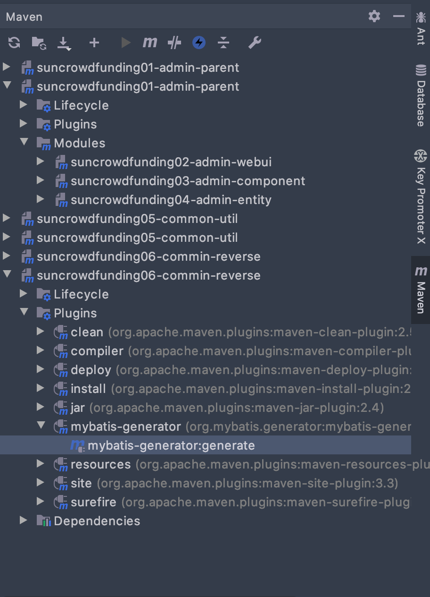


### 4.4 **逆向工程生成的资源各归各位**

WebUI 工程将来在 Tomcat 上运行时，现在 resources 目录下的资源会直接放在 

WEB-INF/classes 目录（也就是类路径）下，所以放在 resources 目录下运行的时候更容 

易找到。

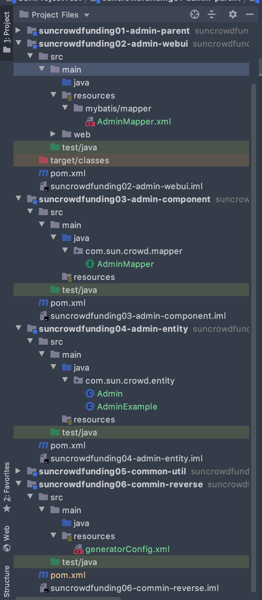


## 5. **父工程依赖管理**  v0.0.5

### 5.1 **依赖信息来源**

1. 到专门网站搜索 ：https://mvnrepository.com 

2.  调试：根据实际运行情况，确认 jar 包之间是否兼容 

SpringMVC 需要 jackson 的支持，来处理 JSON 数据。但是 SpringMVC 并没有依 赖 jackson。所以需要我们自己保证 jar 包之间的兼容性。 

### 5.2 Spring 版本声明

```xml
<properties>
        <!-- 声明属性，对 Spring 的版本进行统一管理 -->
        <sun.spring.version>4.3.20.RELEASE</sun.spring.version>
        <!-- 声明属性，对 SpringSecurity 的版本进行统一管理 -->
        <sun.spring.security.version>4.2.10.RELEASE</sun.spring.security.version>
    </properties>
```


### 5.3 依赖管理

```xml
<dependencyManagement>
        <dependencies>
            <!-- Spring 依赖 -->
            <!-- https://mvnrepository.com/artifact/org.springframework/spring-orm -->
            <dependency>
                <groupId>org.springframework</groupId>
                <artifactId>spring-orm</artifactId>
                <version>${sun.spring.version}</version>
            </dependency>
            <!-- https://mvnrepository.com/artifact/org.springframework/spring-webmvc -->
            <dependency>
                <groupId>org.springframework</groupId>
                <artifactId>spring-webmvc</artifactId>
                <version>${sun.spring.version}</version>
            </dependency>
            <dependency>
                <groupId>org.springframework</groupId>
                <artifactId>spring-test</artifactId>
                <version>${sun.spring.version}</version>
            </dependency>
            <!-- https://mvnrepository.com/artifact/org.aspectj/aspectjweaver -->
            <dependency>
                <groupId>org.aspectj</groupId>
                <artifactId>aspectjweaver</artifactId>
                <version>1.9.2</version>
            </dependency>
            <!-- https://mvnrepository.com/artifact/cglib/cglib -->
            <dependency>
                <groupId>cglib</groupId>
                <artifactId>cglib</artifactId>
                <version>2.2</version>
            </dependency>
            <!-- 数据库依赖 --> <!-- MySQL 驱动 -->
            <dependency>
                <groupId>mysql</groupId>
                <artifactId>mysql-connector-java</artifactId>
                <version>8.0.19</version>
            </dependency>
            <!-- 数据源 -->
            <dependency>
                <groupId>com.alibaba</groupId>
                <artifactId>druid</artifactId>
                <version>1.0.31</version>
            </dependency>
            <!-- MyBatis -->
            <dependency>
                <groupId>org.mybatis</groupId>
                <artifactId>mybatis</artifactId>
                <version>3.2.8</version>
            </dependency>
            <!-- MyBatis 与 Spring 整合 -->
            <dependency>
                <groupId>org.mybatis</groupId>
                <artifactId>mybatis-spring</artifactId>
                <version>1.2.2</version>
            </dependency>
            <!-- MyBatis 分页插件 -->
            <dependency>
                <groupId>com.github.pagehelper</groupId>
                <artifactId>pagehelper</artifactId>
                <version>4.0.0</version>
            </dependency>
            <!-- 日志 -->
            <dependency>
                <groupId>org.slf4j</groupId>
                <artifactId>slf4j-api</artifactId>
                <version>1.7.7</version>
            </dependency>
            <dependency>
                <groupId>ch.qos.logback</groupId>
                <artifactId>logback-classic</artifactId>
                <version>1.2.3</version>
            </dependency>

            <!-- 其他日志框架的中间转换包 -->
            <dependency>
                <groupId>org.slf4j</groupId>
                <artifactId>jcl-over-slf4j</artifactId>
                <version>1.7.25</version>
            </dependency>
            <dependency>
                <groupId>org.slf4j</groupId>
                <artifactId>jul-to-slf4j</artifactId>
                <version>1.7.25</version>
            </dependency>

            <!-- Spring 进行 JSON 数据转换依赖 -->
            <dependency>
                <groupId>com.fasterxml.jackson.core</groupId>
                <artifactId>jackson-core</artifactId>
                <version>2.9.8</version>
            </dependency>
            <dependency>
                <groupId>com.fasterxml.jackson.core</groupId>
                <artifactId>jackson-databind</artifactId>
                <version>2.9.8</version>
            </dependency>

            <!-- JSTL 标签库 -->
            <dependency>
                <groupId>jstl</groupId>
                <artifactId>jstl</artifactId>
                <version>1.2</version>
            </dependency>

            <!-- junit 测试 -->
            <dependency>
                <groupId>junit</groupId>
                <artifactId>junit</artifactId>
                <version>4.12</version>
                <scope>test</scope>
            </dependency>

            <!-- 引入 Servlet 容器中相关依赖 -->
            <dependency>
                <groupId>javax.servlet</groupId>
                <artifactId>servlet-api</artifactId>
                <version>2.5</version>
                <scope>provided</scope>
            </dependency>

            <!-- JSP 页面使用的依赖 -->
            <dependency>
                <groupId>javax.servlet.jsp</groupId>
                <artifactId>jsp-api</artifactId>
                <version>2.1.3-b06</version>
                <scope>provided</scope>
            </dependency>
            <!-- https://mvnrepository.com/artifact/com.google.code.gson/gson -->
            <dependency>
                <groupId>com.google.code.gson</groupId>
                <artifactId>gson</artifactId>
                <version>2.8.5</version>
            </dependency>
            <!-- SpringSecurity 对 Web 应用进行权限管理 -->
            <dependency>
                <groupId>org.springframework.security</groupId>
                <artifactId>spring-security-web</artifactId>
                <version>4.2.10.RELEASE</version>
            </dependency>
            <!-- SpringSecurity 配置 -->
            <dependency>
                <groupId>org.springframework.security</groupId>
                <artifactId>spring-security-config</artifactId>
                <version>4.2.10.RELEASE</version>
            </dependency>
            <!-- SpringSecurity 标签库 -->
            <dependency>
                <groupId>org.springframework.security</groupId>
                <artifactId>spring-security-taglibs</artifactId>
                <version>4.2.10.RELEASE</version>
            </dependency>
        </dependencies>
    </dependencyManagement>
```

## 6. Spring **整合** MyBatis v0.0.6

### 6.1 整合思路

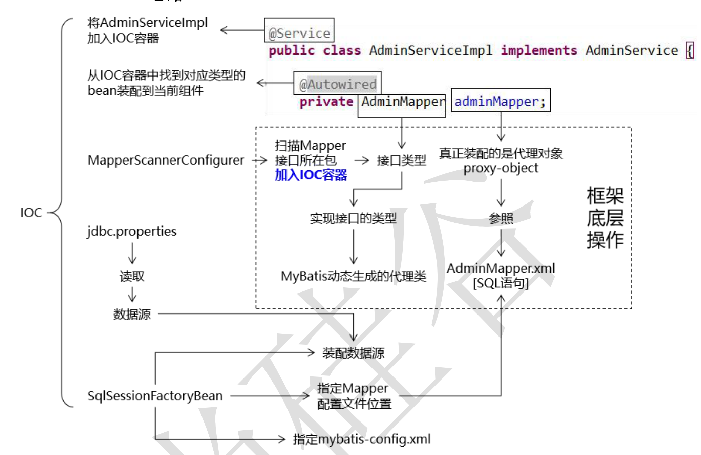

### 6.2 操作步骤

#### 第一步：在子工程中加入搭建环境所需要的依赖

在component 工程添加环境依赖包，原因是具体依赖和 component 工程相关，且依赖效果可以被webui工程传递。

component项目中 pom.xml 依赖项目

```xml

        <!-- Spring 依赖 -->
        <!-- https://mvnrepository.com/artifact/org.springframework/spring-orm -->
        <dependency>
            <groupId>org.springframework</groupId>
            <artifactId>spring-orm</artifactId>
        </dependency>
        <!-- https://mvnrepository.com/artifact/org.springframework/spring-webmvc -->
        <dependency>
            <groupId>org.springframework</groupId>
            <artifactId>spring-webmvc</artifactId>
        </dependency>
        <!-- https://mvnrepository.com/artifact/org.aspectj/aspectjweaver -->
        <dependency>
            <groupId>org.aspectj</groupId>
            <artifactId>aspectjweaver</artifactId>
        </dependency>
        <!-- https://mvnrepository.com/artifact/cglib/cglib -->
        <dependency>
            <groupId>cglib</groupId>
            <artifactId>cglib</artifactId>
        </dependency>

        <!-- MySQL 驱动 -->
        <dependency>
            <groupId>mysql</groupId>
            <artifactId>mysql-connector-java</artifactId>
        </dependency>

        <!-- 数据源 -->
        <dependency>
            <groupId>com.alibaba</groupId>
            <artifactId>druid</artifactId>
        </dependency>

        <!-- MyBatis -->
        <dependency>
            <groupId>org.mybatis</groupId>
            <artifactId>mybatis</artifactId>
        </dependency>

        <!-- MyBatis 与 Spring 整合 -->
        <dependency>
            <groupId>org.mybatis</groupId>
            <artifactId>mybatis-spring</artifactId>
        </dependency>

        <!-- MyBatis 分页插件 -->
        <dependency>
            <groupId>com.github.pagehelper</groupId>
            <artifactId>pagehelper</artifactId>
        </dependency>

        <!-- Spring 进行 JSON 数据转换依赖 -->
        <dependency>
            <groupId>com.fasterxml.jackson.core</groupId>
            <artifactId>jackson-core</artifactId>
        </dependency>
        <dependency>
            <groupId>com.fasterxml.jackson.core</groupId>
            <artifactId>jackson-databind</artifactId>
        </dependency>

        <!-- JSTL 标签库 -->
        <dependency>
            <groupId>jstl</groupId>
            <artifactId>jstl</artifactId>
        </dependency>
        <!-- https://mvnrepository.com/artifact/com.google.code.gson/gson -->
        <dependency>
            <groupId>com.google.code.gson</groupId>
            <artifactId>gson</artifactId>
        </dependency>
```


#### 第二步：准备 jdbc.properties 

位置：

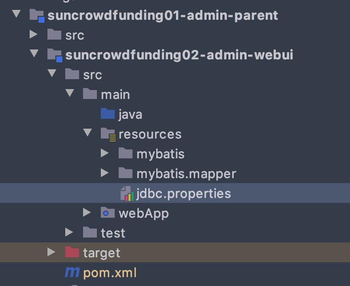

```tex
jdbc.user=root
jdbc.password=Sunxz,123456
jdbc.url=jdbc:mysql://localhost:3306/project_crowd?useUnicode=true&characterEncoding=UTF-8
jdbc.driver=com.mysql.cj.jdbc.Driver
```


#### 第三步：添加mybatis-config.xml

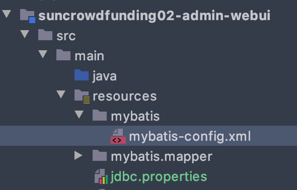

```xml
<?xml version="1.0" encoding="UTF-8"?>
<!DOCTYPE configuration PUBLIC "-//mybatis.org//DTD Config 3.0//EN"
        "http://mybatis.org/dtd/mybatis-3-config.dtd">
<configuration>

</configuration>
```

#### 第四步：创建 Spring 配置文件专门配置 Spring 和 MyBatis 整合相关 

位置：

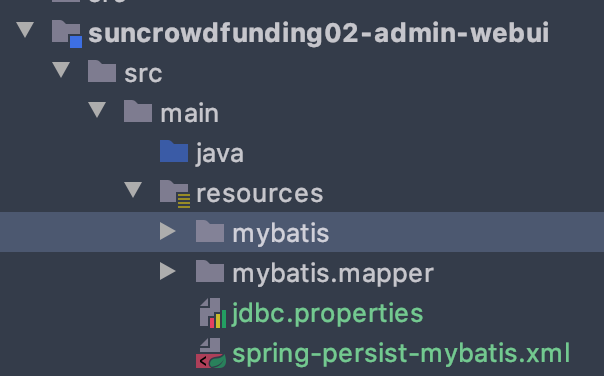

首先创建spring-persist-mybatis.xml 配置文件，导入jdbc配置文件，并配置数据源

```xml
<?xml version="1.0" encoding="UTF-8"?>
<beans xmlns="http://www.springframework.org/schema/beans"
       xmlns:xsi="http://www.w3.org/2001/XMLSchema-instance"
       xmlns:context="http://www.springframework.org/schema/context"
       xsi:schemaLocation="http://www.springframework.org/schema/beans
       http://www.springframework.org/schema/beans/spring-beans.xsd
       http://www.springframework.org/schema/context
       http://www.springframework.org/schema/context/spring-context.xsd">
    <!--1. 导入jdbc配置文件-->
    <context:property-placeholder location="classpath:jdbc.properties"/>

    <!--2. 配置数据源-->
    <bean class="com.alibaba.druid.pool.DruidDataSource" id="dataSource">
        <property name="username" value="${jdbc.user}"/>
        <property name="password" value="${jdbc.password}"/>
        <property name="url" value="${jdbc.url}"/>
        <property name="driverClassName" value="${jdbc.driver}"/>
    </bean>
</beans>
```

配置完成后可以对进行测试

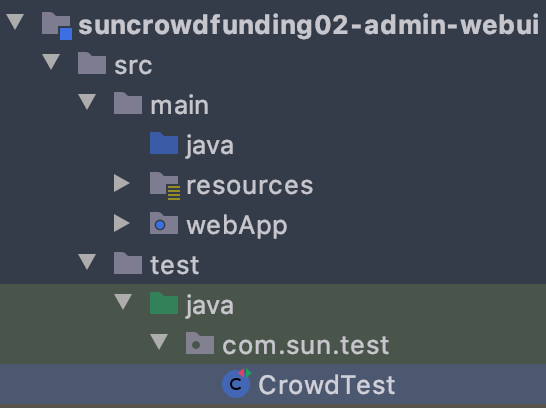

```java
package com.sun.test;

import org.junit.Test;
import org.junit.runner.RunWith;
import org.springframework.beans.factory.annotation.Autowired;
import org.springframework.test.context.ContextConfiguration;
import org.springframework.test.context.junit4.SpringJUnit4ClassRunner;

import javax.sql.DataSource;
import java.sql.Connection;
import java.sql.SQLException;

//在类上标记必要的注解，spring整合junit
@RunWith(SpringJUnit4ClassRunner.class)
@ContextConfiguration(locations = "classpath:spring-persist-mybatis.xml")
public class CrowdTest {

    @Autowired
    private DataSource dataSource;

    @Test
    public void test() throws SQLException {
        Connection connection = dataSource.getConnection();
        System.out.println(connection);
    }
}

```

**注意** 为了能在webui工程中的test scop中执行junit和spring-test，需添加依赖

```xml
 <!-- junit 测试 -->
        <dependency>
            <groupId>junit</groupId>
            <artifactId>junit</artifactId>
            <version>4.12</version>
            <scope>test</scope>
        </dependency>
        <dependency>
            <groupId>org.springframework</groupId>
            <artifactId>spring-test</artifactId>
            <scope>test</scope>
        </dependency>
```

 配置 SqlSessionFactoryBean 

```xml
<!--   3.配置 SqlSessionFactoryBean -->
    <bean class="org.mybatis.spring.SqlSessionFactoryBean" id="sqlSessionFactoryBean">
        <!--指定mybaits全局配置位置-->
        <property name="configLocation" value="classpath:mybatis/mybatis-config.xml"/>
        <!--指定mapper.xml文件位置,不能写指定mapper.xml，而是通配符指定-->
        <property name="mapperLocations" value="classpath:mybatis/mapper/*Mapper.xml"/>
        <!--装配数据源-->
        <property name="dataSource" ref="dataSource"/>
    </bean>
```

配置 MapperScannerConfigurer 

```xml
<!--配置MapperScannerConfigurer来扫描Mapper接口所在包-->
    <bean class="org.mybatis.spring.mapper.MapperScannerConfigurer" id="mapperScannerConfigurer">
        <property name="basePackage" value="com.sun.crowd.mapper"/>
    </bean>
```


#### 第五步：测试是否可以装配 XxxMapper 接口并通过这个接口操作数据库

插入数据测试

```java
//在类上标记必要的注解，spring整合junit
@RunWith(SpringJUnit4ClassRunner.class)
@ContextConfiguration(locations = "classpath:spring-persist-mybatis.xml")
public class CrowdTest {

    @Autowired
    private DataSource dataSource;

    @Autowired
    private AdminMapper adminMapper;

    @Test
    public void testInsert() {
        Admin admin = new Admin(null, "adminTest", "123456", "连接测试", "test.@sun.com", new Date().getTime()+"");
        int i = adminMapper.insertSelective(admin);
        System.out.println(i);
    }
}  
```

## 7. 日志配置 v0.0.7

### 7.1 日志打印位置

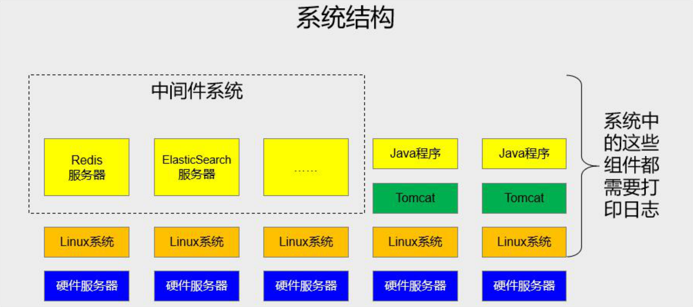

 

### 7.2 常见日志

**门面：**

| 名称                                    | 说明                 |
| --------------------------------------- | -------------------- |
| JCL（Jakarta Commons Logging）          | 陈旧                 |
| SLF4J（Simple Logging Facade for Java） | 适合（**同一作者**） |
| jboss-logging                           | 特殊专业领域使用     |

**实现：**

| 名称                     | 说明                                    |
| ------------------------ | --------------------------------------- |
| log4j                    | 最初版（**同一作者**）                  |
| JUL（java.util.logging） | JDK 自带                                |
| log4j2 Apache            | 收购 log4j 后全面重构，内部实现和 log4j |
| logback                  | 优雅、强大（**同一作者**）              |

**不同日志系统的整合**

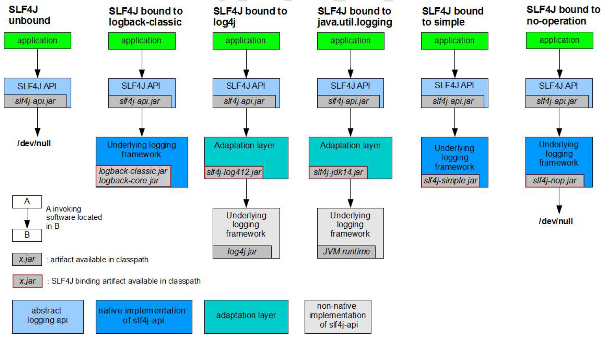


**替换方案**

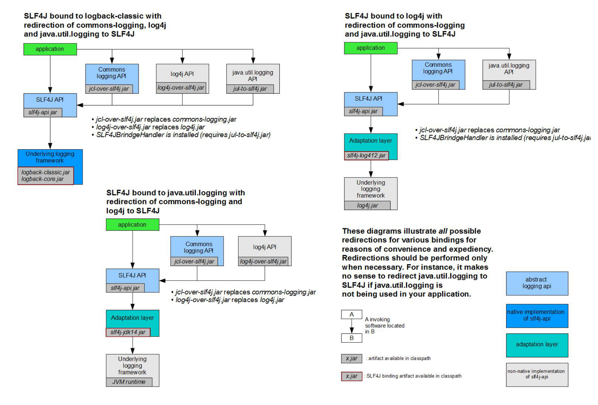

### 7.3 替换spring 默认的Commons-logging

引入依赖包

```xml
				<!-- 日志 -->
        <dependency>
            <groupId>org.slf4j</groupId>
            <artifactId>slf4j-api</artifactId>
        </dependency>
        <dependency>
            <groupId>ch.qos.logback</groupId>
            <artifactId>logback-classic</artifactId>
        </dependency>

        <!-- 其他日志框架的中间转换包 -->
        <!--覆盖spring默认的 Commons-logging -->
        <dependency>
            <groupId>org.slf4j</groupId>
            <artifactId>jcl-over-slf4j</artifactId>
        </dependency>
        <!--将java默认的jul 转换到slf4j输出-->
        <dependency>
            <groupId>org.slf4j</groupId>
            <artifactId>jul-to-slf4j</artifactId>
        </dependency>
```


排除commons-logging包，

在test域中的spring-text包会引入依赖要排除

```xml
        <dependency>
            <groupId>org.springframework</groupId>
            <artifactId>spring-test</artifactId>
            <scope>test</scope>
            <!--排除自带的日志框架，使用slf4j打印日志-->
            <exclusions>
                <exclusion>
                    <groupId>commons-logging</groupId>
                    <artifactId>commons-logging</artifactId>
                </exclusion>
            </exclusions>
        </dependency>
```


spring-orm中依赖的spring-core下，也有依赖，要排除

```xml
        <dependency>
            <groupId>org.springframework</groupId>
            <artifactId>spring-orm</artifactId>
            <!--排除自带的日志框架，使用slf4j打印日志-->
            <exclusions>
                <exclusion>
                    <groupId>commons-logging</groupId>
                    <artifactId>commons-logging</artifactId>
                </exclusion>
            </exclusions>
        </dependency>
```

添加了 jcl-over-slf4j 包后也能自动覆盖依赖

### 7.4 logback.xml 配置文件

logback 工作时的具体细节可以通过 logback.xml 来配置。

```xml
<?xml version="1.0" encoding="UTF-8"?>
<configuration debug="true">
    <!-- 指定日志输出的位置 -->
    <appender name="STDOUT" class="ch.qos.logback.core.ConsoleAppender">
        <encoder>
            <!-- 日志输出的格式 -->
            <!-- 按照顺序分别是：时间、日志级别、线程名称、打印日志的类、日志主体 内容、换行 -->
            <pattern>[%d{HH:mm:ss.SSS}] [%-5level] [%thread] [%logger] [%msg]%n</pattern>
        </encoder>
    </appender>
    <!-- 设置全局日志级别。日志级别按顺序分别是：DEBUG、INFO、WARN、ERROR -->
    <!-- 指定任何一个日志级别都只打印当前级别和后面级别的日志。 -->
    <root level="INFO">
        <!-- 指定打印日志的 appender，这里通过“STDOUT”引用了前面配置的 appender -->
        <appender-ref ref="STDOUT"/>
    </root>
    <!-- 根据特殊需求指定局部日志级别 -->
    <logger name="com.atguigu.crowd.mapper" level="DEBUG"/>
</configuration>
```

日志测试

```java
 @Test
    public void testLog(){
        //获取logger类，传入的class对象就是当前打印日志的类
        Logger logger = LoggerFactory.getLogger(CrowdTest.class);

        //根据不同的日志级别打印日志
        logger.debug("Im Debug Level");
        logger.debug("Im Debug Level");
        logger.debug("Im Debug Level");

        logger.info("Im Info Level");
        logger.info("Im Info Level");
        logger.info("Im Info Level");

        logger.warn("Im Warn Level");
        logger.warn("Im Warn Level");
        logger.warn("Im Warn Level");

        logger.error("Im Error Level");
        logger.error("Im Error Level");
        logger.error("Im Error Level");
    }
```

日志输出结果

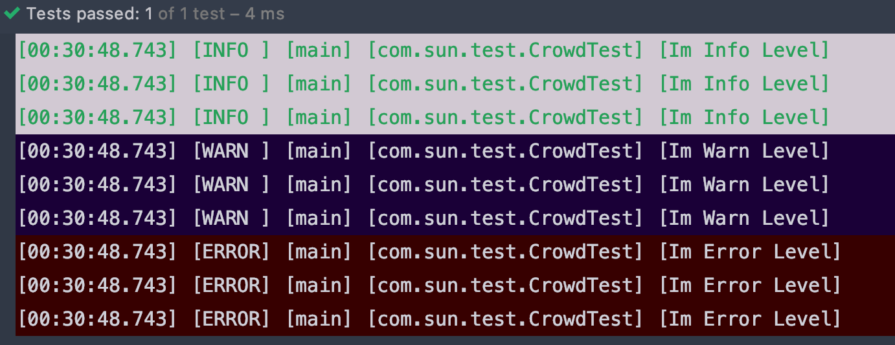


## 8. 明式事务 v0.0.8

### 8.1 目标 

从事务角度：一个事务方法中包含的多个数据库操作，要么一起提交、要么一起回 

滚。也就是说事务方法中的多个数据库操作，有任何一个失败，整个事务全部回滚。 


从声明式角度：由 Spring 来全面接管数据库事务。用声明式代替编程式。


### 8.2 思路

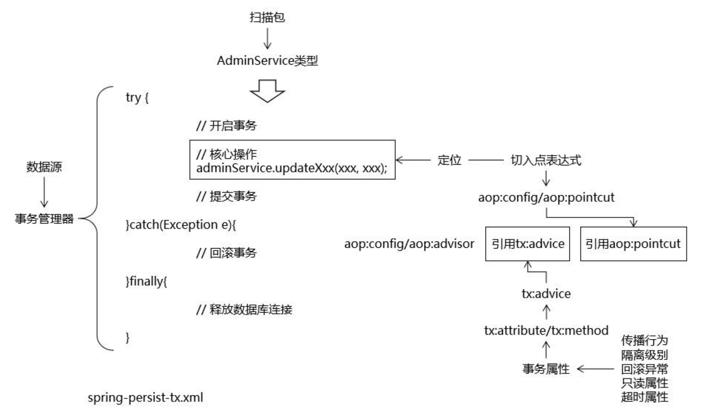

### 8.3 操作

#### 8.3.1 加入 AOP 依赖包

```xml
<!-- AOP 所需依赖 -->
<dependency>
    <groupId>org.aspectj</groupId>
    <artifactId>aspectjweaver</artifactId>
</dependency> 
<!-- AOP 所需依赖 -->
<dependency>
    <groupId>cglib</groupId>
    <artifactId>cglib</artifactId>
</dependency>
```

#### 8.3.2 配置 Spring 声明式事务

第一步：在类路径下创建spring-persist-tx.xml

```xml
<?xml version="1.0" encoding="UTF-8"?>
<beans xmlns="http://www.springframework.org/schema/beans"
       xmlns:xsi="http://www.w3.org/2001/XMLSchema-instance"
       xmlns:context="http://www.springframework.org/schema/context"
       xmlns:aop="http://www.springframework.org/schema/aop" xmlns:tx="http://www.springframework.org/schema/tx"
       xsi:schemaLocation="http://www.springframework.org/schema/beans
       http://www.springframework.org/schema/beans/spring-beans.xsd
        http://www.springframework.org/schema/context
       http://www.springframework.org/schema/context/spring-context.xsd
       http://www.springframework.org/schema/aop
       http://www.springframework.org/schema/aop/spring-aop.xsd http://www.springframework.org/schema/tx http://www.springframework.org/schema/tx/spring-tx.xsd">
  
    <!--配置自动扫描的包，把service扫描到ioc容器中-->
    <context:component-scan base-package="com.sun.crowd.service"/>
    <!--配置事务管理器-->
    <bean id="txManager" class="org.springframework.jdbc.datasource.DataSourceTransactionManager">
        <!--装配数据源-->
        <property name="dataSource" ref="dataSource"/>
    </bean>

    <!--配置事务的切面-->
    <aop:config>
        <!--考虑到后期整合SpringSecurity，避免吧UserDetailsService加入事务控制，让切入点定位到ServiceImpl中-->
        <aop:pointcut id="txPointCut" expression="execution(* *..*ServiceImpl.*(..))"/>
        <!--将切入点和事务通知关联起来-->
        <aop:advisor advice-ref="txAdvice" pointcut-ref="txPointCut"/>
    </aop:config>

    <!--配置事务的通知-->
    <tx:advice transaction-manager="txManager" id="txAdvice">
        <!--配置事务的属性-->
        <tx:attributes>
            <!--查询方法：配置只读，让数据库知道这是一个查询操作，从而进行优化-->
            <tx:method name="get*" read-only="true"/>
            <tx:method name="find*" read-only="true"/>
            <tx:method name="query*" read-only="true"/>
            <tx:method name="count*" read-only="true"/>
            <!--增删改查方法：配置事务的传播行为，回滚异常-->
            <!--默认运行时异常回滚，建议编译和运行异常都回滚-->
            <tx:method name="save*" propagation="REQUIRES_NEW" rollback-for="java.lang.Exception"/>
            <tx:method name="update*" propagation="REQUIRES_NEW" rollback-for="java.lang.Exception"/>
            <tx:method name="remove*" propagation="REQUIRES_NEW" rollback-for="java.lang.Exception"/>
            <tx:method name="batch*" propagation="REQUIRES_NEW" rollback-for="java.lang.Exception"/>
        </tx:attributes>
    </tx:advice>
</beans>
```

#### 8.3.3 测试是事务管理是否切入

新建 adminService 接口，并实现 adminServiceImpl 

adminService 接口

```java
package com.sun.crowd.service.api;
import com.sun.crowd.entity.Admin;

public interface AdminService {
    void saveAdmin(Admin admin);
}

```

adminServiceImpl 类

```java
package com.sun.crowd.service.impl;

import com.sun.crowd.entity.Admin;
import com.sun.crowd.mapper.AdminMapper;
import com.sun.crowd.service.api.AdminService;
import org.springframework.beans.factory.annotation.Autowired;
import org.springframework.stereotype.Service;

@Service
public class AdminServiceImpl implements AdminService {

    @Autowired
    private AdminMapper adminMapper;

    @Override
    public void saveAdmin(Admin admin) {
        adminMapper.insert(admin);
    }
}
```


测试类

```java
//在类上标记必要的注解，spring整合junit
@RunWith(SpringJUnit4ClassRunner.class)
@ContextConfiguration(locations = {"classpath:spring-persist-mybatis.xml","classpath:spring-persist-tx.xml"})
public class CrowdTest {

    @Autowired
    private AdminService adminService;

    @Test
    public void testTx(){
        Admin admin = new Admin(null, "adminTest", "123456", "tx测试", "test.@sun.com", new Date().getTime()+"");
        adminService.saveAdmin(admin);
    }
}
```


## 9. 表述层基本配置V0.0.9

### 9.1 启动过程

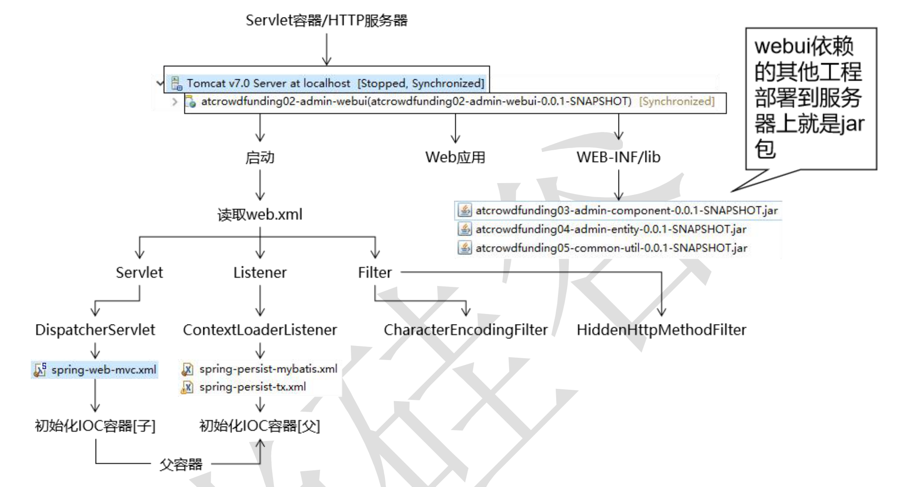

### 9.2 访问流程

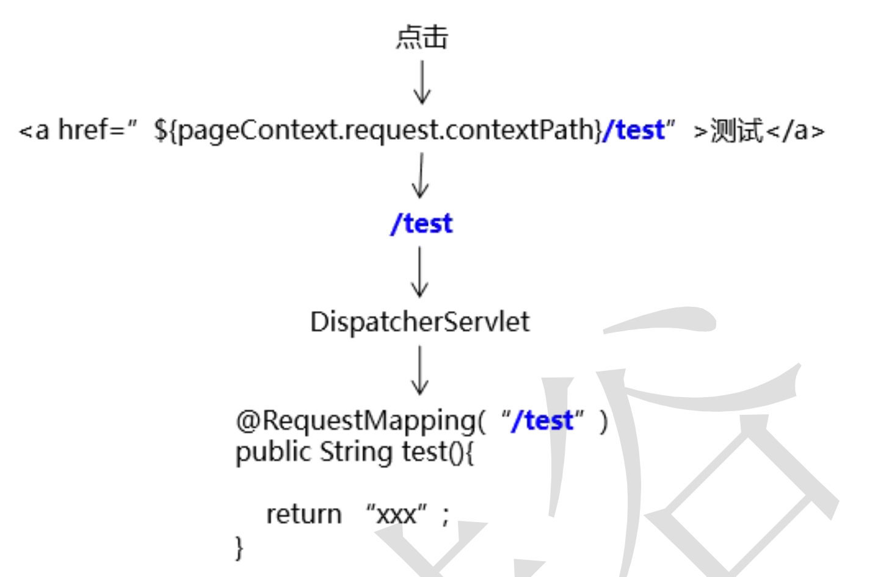

### 9.3 环境搭建

#### 9.3.1 依赖包

使用 SpringMVC 环境引入 spring-webmvc 依赖即可，同时可以把 spring-context 依赖去掉，因为根据依赖的传递性，spring-webmvc 会依赖 spring-context。

```xml
<!-- https://mvnrepository.com/artifact/org.springframework/spring-webmvc -->
<dependency>
    <groupId>org.springframework</groupId>
    <artifactId>spring-webmvc</artifactId>
</dependency>
```

#### 9.3.2 web.xml 配置

```xml
<?xml version="1.0" encoding="UTF-8"?>
<web-app xmlns="http://xmlns.jcp.org/xml/ns/javaee"
         xmlns:xsi="http://www.w3.org/2001/XMLSchema-instance"
         xsi:schemaLocation="http://xmlns.jcp.org/xml/ns/javaee http://xmlns.jcp.org/xml/ns/javaee/web-app_4_0.xsd"
         version="4.0">
    <!-- 1. 配置 ContextLoaderListener 加载 Spring 配置文件 -->
    <context-param>
        <param-name>contextConfigLocation</param-name>
        <param-value>classpath:spring-persist-*.xml</param-value>
    </context-param>
    <listener>
        <listener-class>org.springframework.web.context.ContextLoaderListener</listener-class>
    </listener>

    <!-- 2. 配置 CharacterEncodingFilter 解决 POST 请求的字符乱码问题 -->
    <filter>
        <filter-name>CharacterEncodingFilter</filter-name>
        <filter-class>org.springframework.web.filter.CharacterEncodingFilter</filter-class>
        <init-param>
            <param-name>encoding</param-name>
            <param-value>utf-8</param-value>
        </init-param>
        <init-param>
            <param-name>forceRequestEncoding</param-name>
            <param-value>true</param-value>
        </init-param>
        <init-param>
            <param-name>forceResponseEncoding</param-name>
            <param-value>true</param-value>
        </init-param>
    </filter>
    <filter-mapping>
        <filter-name>CharacterEncodingFilter</filter-name>
        <url-pattern>/*</url-pattern>
    </filter-mapping>

    <!-- 3. 配置 SpringMVC 的前端控制器 -->
    <servlet>
        <servlet-name>dispatcherServlet</servlet-name>
        <servlet-class>org.springframework.web.servlet.DispatcherServlet</servlet-class>
        <!-- 以初始化参数的形式指定 SpringMVC 配置文件的位置 -->
        <init-param>
            <param-name>contextConfigLocation</param-name>
            <param-value>classpath:spring-persist-mvc.xml</param-value>
        </init-param>
        <!--servlet默认初始化是在类第一次接受时请求的，
        而dispacherServlet创建对象后对象会有大量的框架初始化工作，不适合第一次请求时创建
        设置load-on-startup就是为了在web启动时创建对象-->
        <load-on-startup>1</load-on-startup>
    </servlet>
    <servlet-mapping>
        <servlet-name>dispatcherServlet</servlet-name>
        <!--配置1：/表示拦截所有请求
        <url-pattern>/</url-pattern> -->
        <!--配置2：配置请求扩展名
        优点1：css。js等静态资源可以不经过spirngmvc，不需要处理
        优点2：实现伪静态效果，表面上是一个html静态资源，但实际是java运算生成的，有利于seo优化，可以增加入侵难度
        缺点：不符合restful风格-->
        <url-pattern>*.html</url-pattern>
        <!--如果ajax请求的扩展名时html，但实际服务器返回给浏览器的是json，两者不匹配会出现406错误-->
        <url-pattern>*.json</url-pattern>
    </servlet-mapping>
</web-app>
```

**注意**：在 web.xml 中存在多个 Filter 时，让这个 Filter 作为过滤器链中的第一个 Filter。

#### 9.3.3 spring-web-mvc.xml 配置

```xml
<?xml version="1.0" encoding="UTF-8"?>
<beans xmlns="http://www.springframework.org/schema/beans"
       xmlns:xsi="http://www.w3.org/2001/XMLSchema-instance"
       xmlns:context="http://www.springframework.org/schema/context"
       xmlns:mvc="http://www.springframework.org/schema/mvc"
       xsi:schemaLocation="http://www.springframework.org/schema/beans
       http://www.springframework.org/schema/beans/spring-beans.xsd
       http://www.springframework.org/schema/context
       http://www.springframework.org/schema/context/spring-context.xsd
       http://www.springframework.org/schema/mvc
       http://www.springframework.org/schema/mvc/spring-mvc.xsd">
    <!--自动扫描Controller注解的handler-->
    <context:component-scan base-package="com.sun.crowd"/>
    <!--配置注解驱动-->
    <mvc:annotation-driven/>
    <!--配置视图解析器-->
    <bean class="org.springframework.web.servlet.view.InternalResourceViewResolver" id="viewResolver">
        <property name="prefix" value="/WEB-INF/"/>
        <property name="suffix" value=".jsp"/>
    </bean>
</beans>
```

#### 9.3.4 页面base标签

**作用：** 将页面上路径中的**${pageContext.request.contextPath}**部分提取到页面开头

**在webui包中加入依赖**

```xml
<!-- 引入 Servlet 容器中相关依赖 --> 
<dependency> 
  <groupId>javax.servlet</groupId> 
  <artifactId>servlet-api</artifactId> 
  <scope>provided</scope> 
</dependency> 
<!-- JSP 页面使用的依赖 --> 
<dependency> 
  <groupId>javax.servlet.jsp</groupId> 
  <artifactId>jsp-api</artifactId> 
  <scope>provided</scope> 
</dependency>
```

**base标签写法**

```xml
<base href="http://${pageContext.request.serverName }:${pageContext.request.serverPort }${page Context.request.contextPath }/"/>
```

**注意**

* base 标签必须写在 head 标签内部 

* base 标签必须在所有“带具体路径”的标签的前面 

* serverName 部分 EL 表达式和 serverPort 部分 EL 表达式之间必须写“:” 

* serverPort 部分 EL 表达式和 contextPath 部分 EL 表达式之间绝对不能写“/” 
  * 原因：contextPath 部分 EL 表达式本身就是“/”开头，如果多写一个“/”会干扰 Cookie 的工作机制 

* serverPort 部分 EL 表达式后面必须写“/”

###  9.4 测试

#### 9.4.1 **编写** **handler** **方法** 

```java
package com.sun.crowd.mvc.handler;

import ...

@Controller
public class TestHandler {

    @Autowired
    private AdminService adminService;

    @RequestMapping("/test/ssm.html")
    public String testSsm(Model model) {
        List<Admin> admins = adminService.getAll();
        model.addAttribute("admins", admins);
        return "target";
    }
}

```

#### 9.4.2 **创建目标** JSP 页面（视图）

```html
<%@ page contentType="text/html;charset=UTF-8" %>
<html>
<head>
  <title>$Title$</title>
</head>
<base href="http://${pageContext.request.serverName}:${pageContext.request.serverPort}${pageContext.request.contextPath}/"/>
<body>
<a href="test/ssm.html">
  测试ssm
</a>
</body>
</html>

```


#### 9.4.3 目标target

```html
<%@ page contentType="text/html;charset=UTF-8"  %>
<html>
<head>
    <title>target</title>
</head>
<body>
<h1>
    mvcTest
</h1>
${requestScope.admins}
</body>
</html>

```

## 10. **SpringMVC** **环境下的** **Ajax** 请求 V0.0.10

前端发送过来，后端要处理的请求有两种： 

**普通请求**：后端处理完成后返回**页面**，浏览器使用使用页面替换整个窗口中的 

内容

**Ajax** **请求**：后端处理完成后通常返回 **JSON** **数据**，jQuery 代码使用 JSON 数据 

对页面局部更新 


### 10.1 引入依赖


```xml
 <!-- Spring 进行 JSON 数据转换依赖 -->
<dependency>
    <groupId>com.fasterxml.jackson.core</groupId>
    <artifactId>jackson-core</artifactId>
</dependency>
<dependency>
    <groupId>com.fasterxml.jackson.core</groupId>
    <artifactId>jackson-databind</artifactId>
</dependency>
```


### 10.2 引入jquery方便测试

路径：

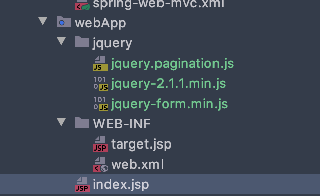

添加标签引入

```html
<script type="text/javascript" src="jquery/jquery-2.1.1.min.js"></script>
```


### 10.3 统一返回数据格式

编写工具类ResultEntity\<T>

```java
package com.sun.crowd.util;

/**
 * 同一项目中Ajax请求返回的结果（未来也可以用于分布式架构各个模块间返回同一样式的数据
 * @author sun
 * @param <T>
 */
public class ResultEntity<T> {

    public static final String SUCCESS = "SUCCESS";
    public static final String FAILED = "FAILED";

    /**
     * 用来封装当前请求处理的结果是成功还是失败
     */
    private String result;

    /**
     * 请求处理失败时返回的错误信息
     */
    private String message;

    /**
     * 要返回的数据
     */
    private T data;

    /**
     * 请求返回成功且不需要带数据时使用的工具方法
     * @return
     */
    public static <Type> ResultEntity<Type> successWithoutData() {
        return new ResultEntity<Type>(SUCCESS, null, null);
    }

    /**
     *  请求成功并且需要返回数据使用的工具方法
     * @param data 返回前端的数据
     * @return
     */
    public static <Type> ResultEntity<Type> successWithData(Type data) {
        return new ResultEntity<Type>(SUCCESS, null, data);
    }

    /**
     * 请求处理失败后使用的工具方法
     * @param message 错误的消息
     * @return
     */
    public static <Type> ResultEntity<Type> failed(String message) {
        return new ResultEntity<Type>(FAILED, message, null);
    }

    public ResultEntity() {
    }

    public ResultEntity(String result, String message, T data) {
        this.result = result;
        this.message = message;
        this.data = data;
    }

    @Override
    public String toString() {
        return "ResultEnity{" +
                "result='" + result + '\'' +
                ", message='" + message + '\'' +
                ", data=" + data +
                '}';
    }

    public String getResult() {
        return result;
    }

    public void setResult(String result) {
        this.result = result;
    }

    public String getMessage() {
        return message;
    }

    public void setMessage(String message) {
        this.message = message;
    }

    public T getData() {
        return data;
    }

    public void setData(T data) {
        this.data = data;
    }
}
```


### 10.4 编写测试

testHandler 中接受的方法

```java
@RequestMapping("/send/ajaxTest.json")
@ResponseBody
public ResultEntity<Admin> testReceive(@RequestBody Admin admin) {
    System.out.println("admin"+admin);
    return ResultEntity.successWithData(admin);
}
```


前端的ajax请求

```js
$(function () {
    $("#btn").click(function () {
        const admin={
            "id":1234567,
            "logAcct":"ajaxTest",
            "userPswd":"123456789",
            "userName": "ajaxTest",
            "email": "123@123.com"
        };
        const request=JSON.stringify(admin);
        $.ajax({
            "url": "send/ajaxTest.json",
            "type": "post",
            "contentType":"application/json;charset=UTF-8",
            "data": request,
            "dataType": "json",
            "success": function (response) {
                console.log(response);
            },
            "error": function (response) {
                console.log(response);
            }
        });
    })
})
```

前台打印结果

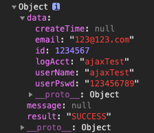

**注意**

* 必须开启 SpringMVC 的注解驱动 :\<mvc:annotation-driven/> 

*  必须有 jackson 依赖 `jackson-core` ,`jackson-databind` 

* 扩展名需要和实际返回的数据格式一致 

  * 响应体返回 JSON 

  * 请求扩展名*.json *

* web.xml 中 DispatcherServlet 必须映射*.json 扩展名

* 前端必须要设置 contentType: `contentType":"application/json;charset=UTF-8`

* 前端接受的dataType也为json，可以自动转换为json类型的数据

## 11. 异常映射

### 11.1 目标

统一管理项目中的异常 

* 抛出异常 

* 显示异常信息 
  * 普通请求：在页面上显示异常信息 
  * Ajax 请求：返回 JSON 数据

### 11.2 实现思路

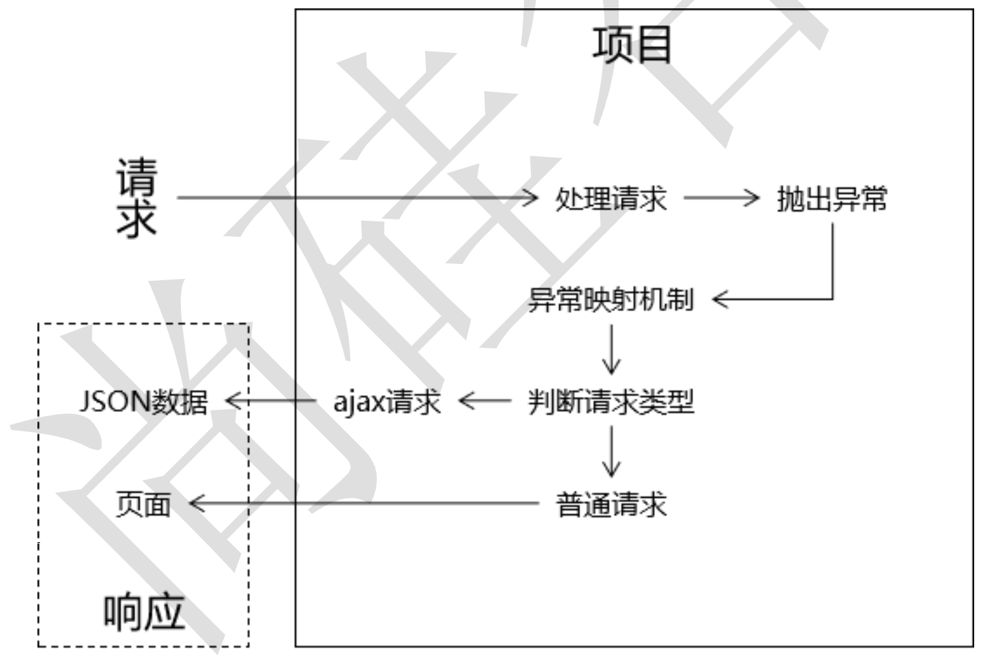

### 11.3 实现步骤：

#### 11.3.1 创建工具类方法，判断请求类型

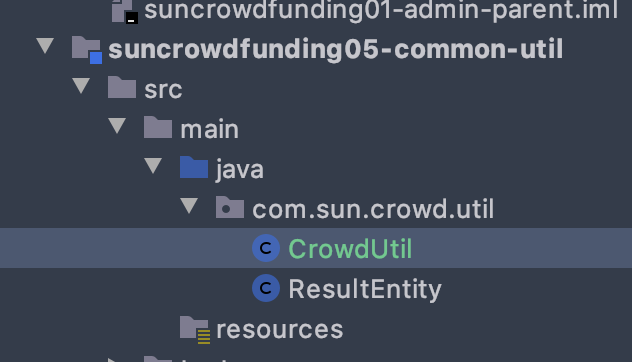


代码

```java
package com.sun.crowd.util;

import javax.servlet.http.HttpServletRequest;

public class CrowdUtil {

    /**
     * 判断当前请求是否为ajax请求
     * @param request 请求对象
     * @return
     *      true：当前为ajax请求
     *      false：当前不是ajax请求
     */
    public static boolean judgeRequestType(HttpServletRequest request){
        //1. 获取请求消息头
        String accept = request.getHeader("Accept");
        String xRequestHeader = request.getHeader("X-Request-With");

        return (accept != null && accept.contains("application/json"))
                ||
                (xRequestHeader !=null && xRequestHeader.contains("XMLHttpRequest"));
    }
}
```


#### 11.3.2 基于XML 实现异常映射

spring-web-mvc.xml 文件中的配置

```xml
    <!--配置基于xml的注解  -->
    <bean class="org.springframework.web.servlet.handler.SimpleMappingExceptionResolver" id="simpleMappingExceptionResolver">
        <!--配置异常类型和具体视图的页面对应关系-->
        <property name="exceptionMappings">
            <props>
                <!--标签体中写对应的视图（会拼写得到路径）-->
                <prop key="java.lang.Exception">system-error</prop>
            </props>
        </property>
    </bean>
```

新建错误跳转视图 system-error.jsp 页面

```jsp
<%@ page contentType="text/html;charset=UTF-8" language="java" %>
<html>
<head>
    <title>error</title>
</head>
<body>
<h1>出错啦</h1>
<%--从请求域中取出exception对象在进一步访问message信息--%>
${requestScope.exception.message}
</body>
</html>
```


#### 11.3.3 基于注解实现异常映射

创建异常处理器类

```java
package com.sun.crowd.mvc.config;

import ...

/**
 * ControllerAdvice 表示当前类是一个基于注解的异常处理类
 *
 * @author sun
 */
@ControllerAdvice
public class CrowdExceptionResolver {

    @ExceptionHandler(value = ArithmeticException.class)
    public ModelAndView resolveMathException(
            ArithmeticException exception,
            HttpServletRequest request,
            HttpServletResponse response
    ) throws IOException {
        return commonResolve("system-error", exception, response, request);
    }

    /**
     * {@link ExceptionHandler 将一个具体的异常和一个方法关联起来}
     */
    @ExceptionHandler(value = NullPointerException.class)
    public ModelAndView resolverNullPotinterExcepiton(
            NullPointerException exception,
            HttpServletRequest request,
            HttpServletResponse response
    ) throws IOException {
        return commonResolve("system-error", exception, response, request);
    }
    
    /**
     * 公共的异常返回方法
     * @param viweName 实际错误要去的视图
     * @param exception 实际捕获的异常类型
     * @param response  response对象
     * @param request request对象
     */
    private ModelAndView commonResolve(
            String viweName,
            Exception exception,
            HttpServletResponse response,
            HttpServletRequest request
    ) throws IOException {
        // 判断当前请求
        boolean judgeResult = CrowdUtil.judgeRequestType(request);
        // 如果为ajax请求
        if (judgeResult) {
            //1. 创建ResultEntity对象
            ResultEntity<Object> resultEntity = ResultEntity.failed(exception.getMessage());
            // 2. 创建Gson对象
            Gson gson = new Gson();
            //3. 将ResultEntity对象转为json字符串
            String json = gson.toJson(resultEntity);
            //4. 将json字符串作为响应体返回给浏览器
            response.getWriter().write(json);
            return null;
        }
        //不是ajax请求则直接创建modelAndView对象
        ModelAndView modelAndView = new ModelAndView();
        //将exception对象存入模型
        modelAndView.addObject("exception", exception);
        //设置对应的视图名称
        modelAndView.setViewName(viweName);
        return modelAndView;
    }
}
```


